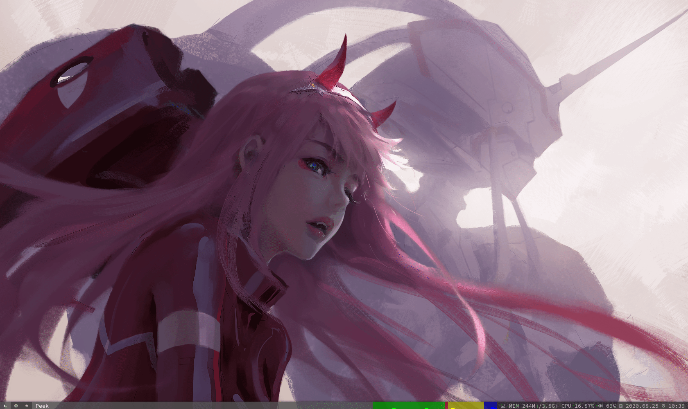

# dwm-bar

#### 预览

#### 配置

> 1. 字体：SauceCodePro Nerd Font Mono （需下载 nerd-fonts-complete）
> 2. 图标：[NerdFonts](https://www.nerdfonts.com/cheat-sheet)
> 3. rainbarf：dwm_rainbarf.sh (需下载 rainbarf)
> 4. 资源：dwm_resources.sh
> 5. 音量：dwm_alsa.sh (需下载 alsa-utils）
> 6. 日期：dwm_date.sh

#### 注意

> 显示颜色需要dwm安装 [dwm-statuscolors-20181008-b69c870.diff](https://dwm.suckless.org/patches/statuscolors/dwm-statuscolors-20181008-b69c870.diff) 补丁（这个补丁有bug，可参照我的dwm中的代码进行改进）